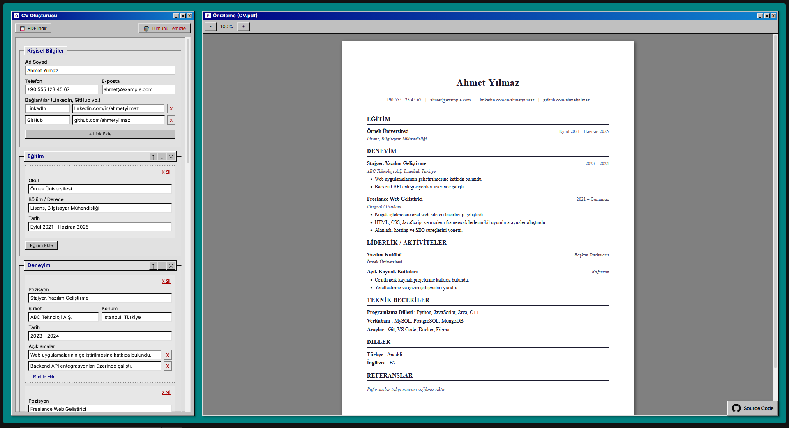

# CV Oluşturucu

Windows 95 temalı, tarayıcı tabanlı CV oluşturucu. Bilgilerinizi girin, canlı önizleme ile kontrol edin ve PDF olarak indirin.

<div align="left">
    
</div>



## Özellikler

- **Canlı Önizleme:** Girdiğiniz bilgileri anında PDF formatına hazır şekilde görün.
- **Kategori Düzenleme:** Kategorileri yukarı/aşağı butonları ile sıralayabilir, dilediğiniz gibi yerleştirebilirsiniz.
- **Dinamik Bağlantılar:** LinkedIn, GitHub, Portfolyo gibi istediğiniz kadar özel bağlantı ekleyebilirsiniz.
- **Özelleştirilebilir Kategoriler:** Klasik eğitim/deneyim bölümlerinin yanı sıra tamamiyle kendi isteğinize göre şekillendirebileceğiniz "Yeni Kategori Ekle" seçeneği (Özel liste, beceri, dil veya düz metin formatlarında).
- **PDF Çıktısı:** "PDF İndir" butonuyla hazırladığınız özgeçmişi doğrudan PDF olarak kaydedin.

## Varsayılan Bölümler

| Bölüm                  | Açıklama                             |
| ---------------------- | ------------------------------------ |
| Kişisel Bilgiler       | Ad, telefon, e-posta, sınırsız link  |
| Eğitim                 | Okul, bölüm, tarih                   |
| Deneyim                | Pozisyon, şirket, konum, açıklamalar |
| Liderlik / Aktiviteler | Kulüpler, gönüllü işler              |
| Teknik Beceriler       | Kategori bazlı beceri listeleri      |
| Diller                 | Dil ve seviye                        |
| Referanslar            | Serbest metin alanı                  |
| **_Özel Kategoriler_** | Kullanıcı tanımlı dilediğiniz bölüm  |

## Kurulum

```bash
npm install
npm run dev
```

Tarayıcıda `http://localhost:5173` adresini açın.

## Teknolojiler

- **Vite**
- **JavaScript**
- **anime.js**
- **CSS**

## Test

Bu proje öncelikli olarak **Zen Browser** üzerinde test edilmiştir.

## Lisans

MIT
